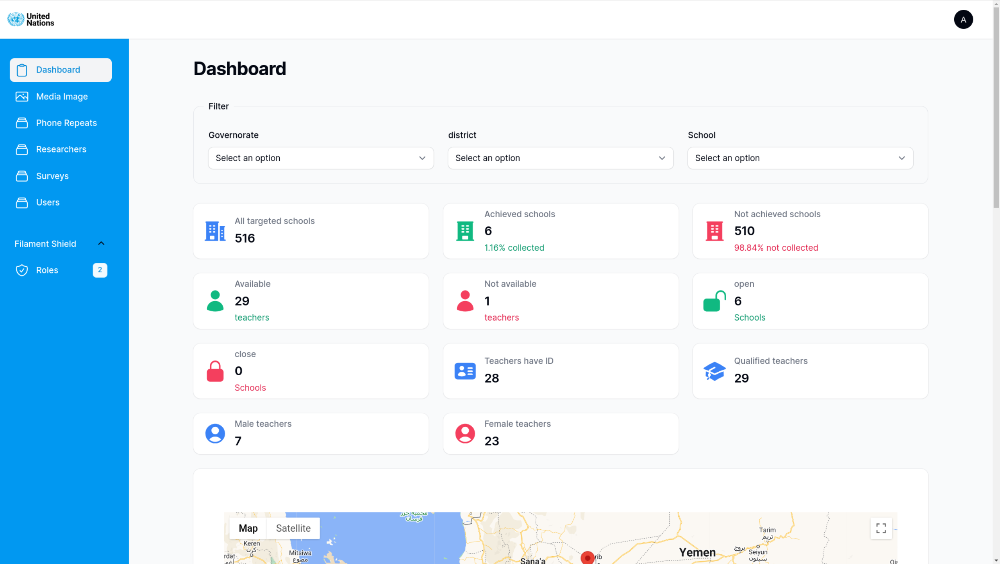
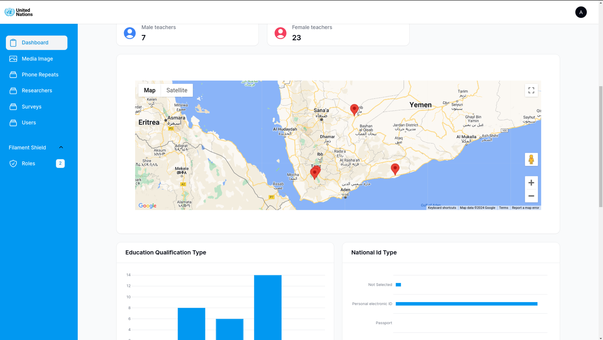
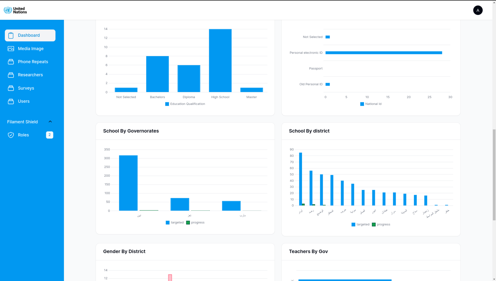
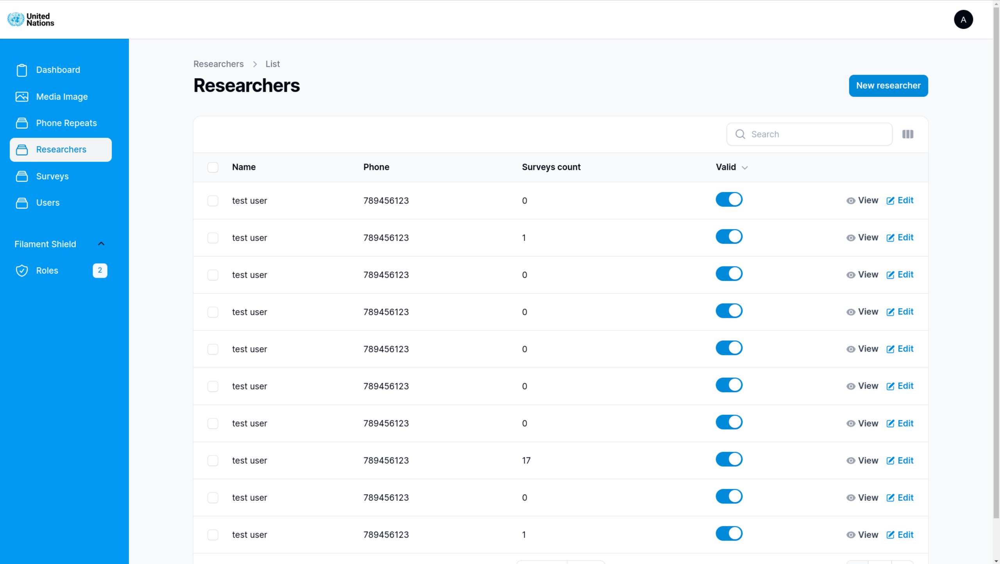
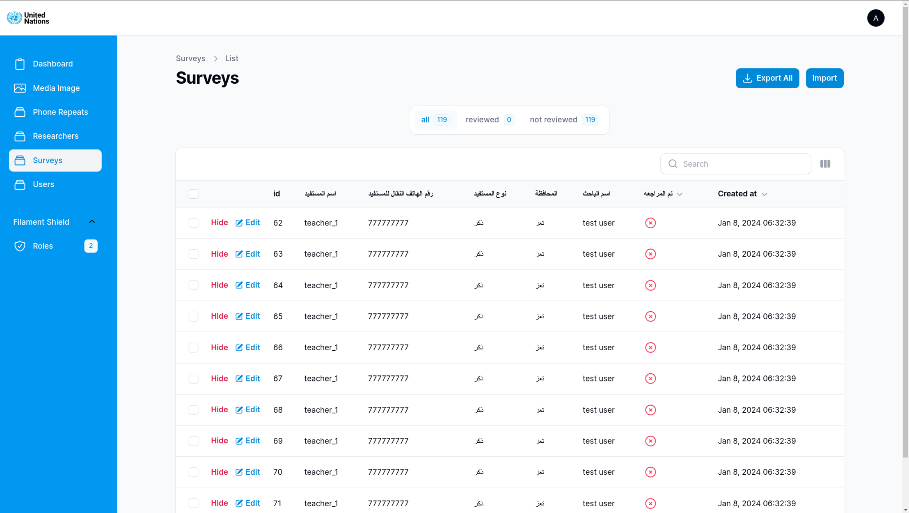
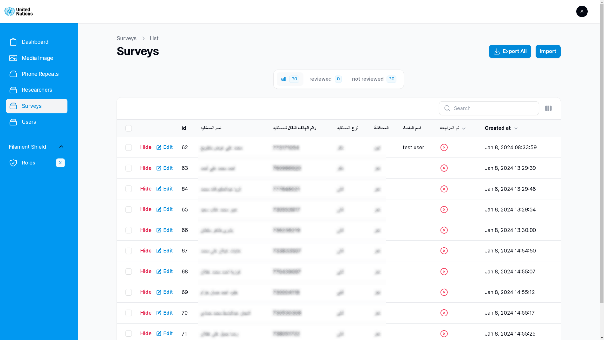
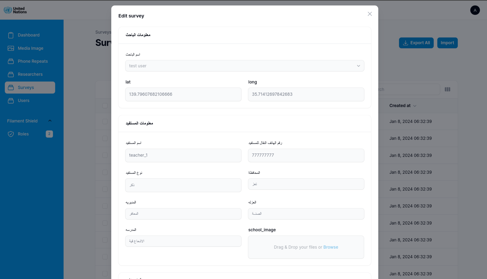
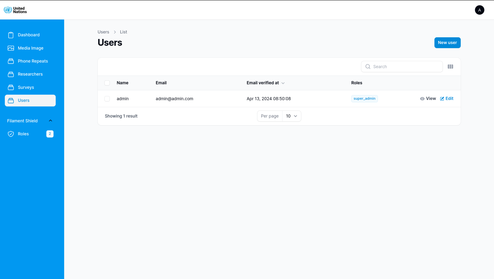
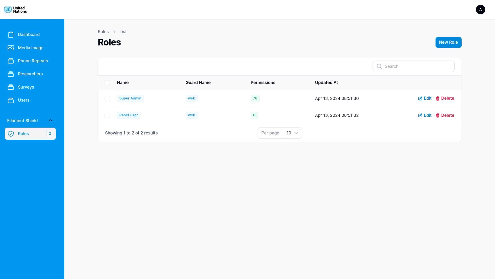

# Survey system

This survey system made to collect teacher info for the Volunteers Teachers Verification program by the UN.

# Tech Stack
- Laravel 10 
- Filament 3
- livewire 3
- Tailwindcss
- Alpinejs
- mysql

# Gallery

- ### Login

- ### Dashboard - statistics

- ### Dashboard - map

- ### Dashboard - charts

- ### Researcher

- ### Surveys

<!-- - ### Surveys - blured
 -->

- ### surveys - details

- ### Users

- ### Rolse

